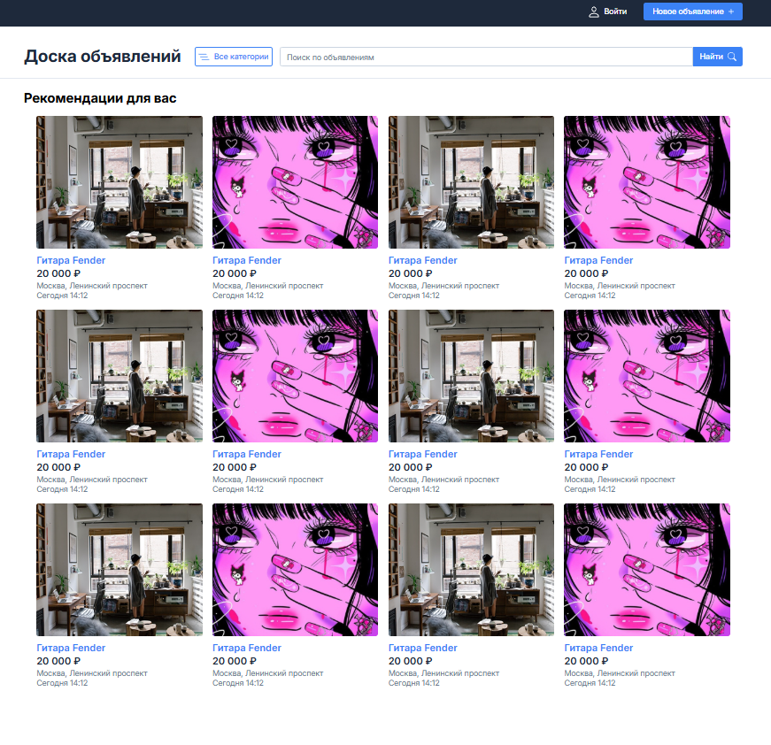

# 📰 Bulletin Board for SolarLab

 

Проект доски объявлений, разработанный в рамках обучения в SolarLab.  
Позволяет публиковать и просматривать сообщения, обмениваться информацией и взаимодействовать с сообществом.

---

## 🚀 Демо

[Посмотреть демо на GitHub Pages](https://tura16.github.io/Bulletin-board-for-SolarLab-/)  


---

## 🛠️ Технологии

- **HTML** — структура страницы  
- **CSS** — стилизация интерфейса  
- **JavaScript** — (если используется для интерактивности)

---

## 📂 Структура проекта

Bulletin-board-for-SolarLab-/
│
├─ index.html # Главная страница
├─ css/ # Стили проекта
├─ fonts/ # Шрифты
├─ icons/ # Иконки
├─ images/ # Изображения
└─ README.md # Этот файл

---

## ⚡ Особенности

- Простой и интуитивно понятный интерфейс  
- Адаптивный дизайн под различные устройства  
- Лёгкая настройка и запуск локально  

---

## 💻 Установка и запуск

1. Клонируйте репозиторий:

   ```bash
   git clone https://github.com/Tura16/Bulletin-board-for-SolarLab-.git


2. Перейдите в директорию проекта:

bash

cd Bulletin-board-for-SolarLab-

3. Откройте файл index.html в браузере.

📌 Будущие улучшения
Динамическое добавление и удаление объявлений

Интеграция с серверной частью для хранения данных

Улучшение интерфейса и добавление анимаций

